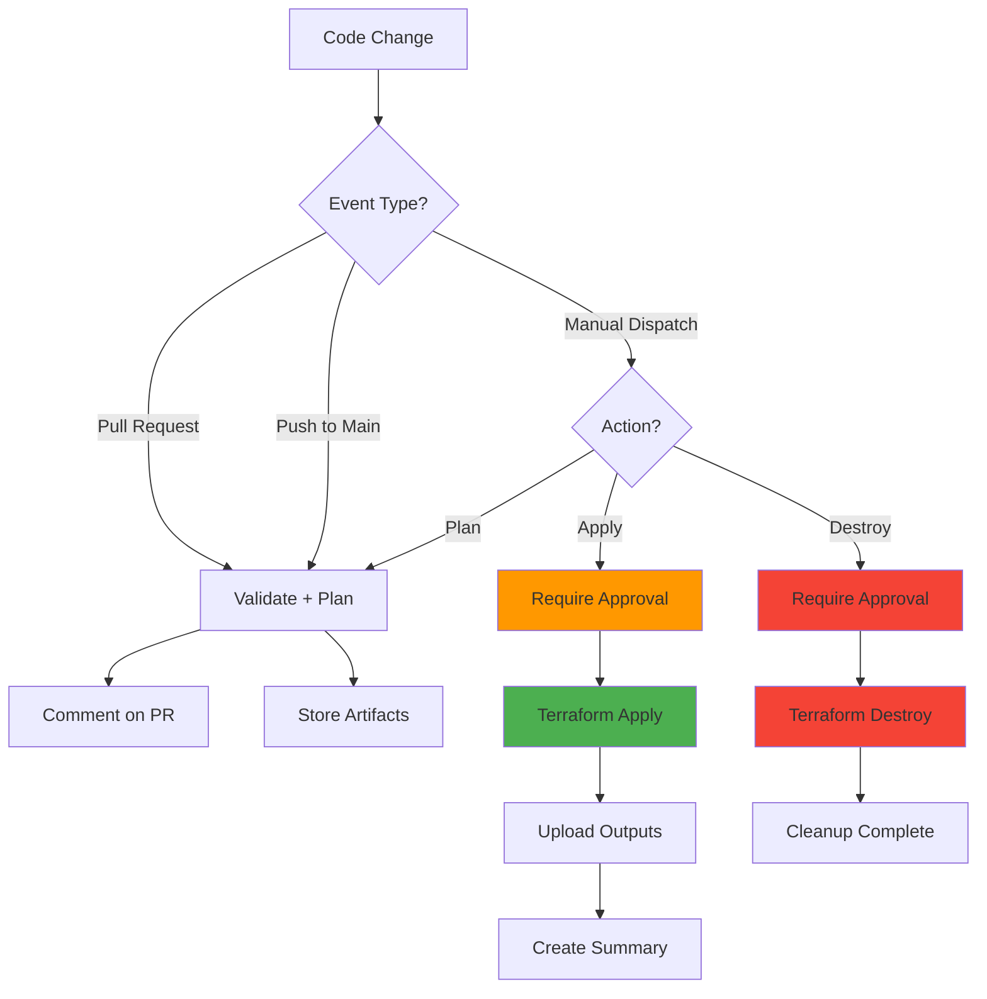

# GitHub Actions Infrastructure Provisioning Guide

## Overview

This guide explains how to use GitHub Actions for automated infrastructure provisioning with Oracle Cloud Infrastructure (OCI) using Terraform.

> 🚀 **New to GitHub Actions?** See [QUICK_START.md](QUICK_START.md) for a 5-minute setup guide!

## 🎯 Best Practice Approach: Direct Terraform Execution

### Why Direct Terraform in GitHub Actions?

This implementation **runs Terraform directly** in GitHub Actions workflows, **without** the Ansible orchestration layer used in local development. Here's why:

#### ✅ Advantages of Direct Terraform in CI/CD:

1. **Industry Standard Practice**
   - HashiCorp provides official `setup-terraform` GitHub Action
   - Direct integration is the most common pattern in modern DevOps
   - Simpler to understand and maintain for CI/CD pipelines

2. **Better CI/CD Integration**
   - Native GitHub Actions support with official actions
   - Cleaner logs and better debugging in the GitHub UI
   - Direct integration with GitHub's security features (OIDC, secrets)

3. **Simplified Pipeline**
   - Fewer dependencies (no need for Ansible in CI/CD)
   - Faster execution (no extra orchestration overhead)
   - Less complexity in the automation chain

4. **State Management**
   - Works seamlessly with remote backends (Terraform Cloud, S3, etc.)
   - Better support for collaborative workflows
   - Built-in locking and state versioning

5. **Cost and Maintenance**
   - One less tool to maintain in CI/CD environment
   - Smaller container images (no Ansible installation)
   - Faster job execution times

#### 🤔 When to Use Ansible Orchestration?

Ansible orchestration (as in `ansible/playbooks/tasks/provision-infrastructure.yml`) is still valuable for:

- **Local Development**: Interactive workflows requiring human approval
- **Complex Orchestration**: When you need to coordinate multiple tools beyond Terraform
- **Custom Validation**: Multi-step processes with custom validation logic
- **Gradual Migration**: Teams transitioning from Ansible-based workflows

#### 📊 Comparison Matrix

| Aspect                       | Direct Terraform (GitHub Actions) | Ansible + Terraform (Local) |
| ---------------------------- | --------------------------------- | --------------------------- |
| **CI/CD Integration**        | ⭐⭐⭐⭐⭐ Native                 | ⭐⭐⭐ Good                 |
| **Simplicity**               | ⭐⭐⭐⭐⭐ Simple                 | ⭐⭐⭐ More complex         |
| **Debugging**                | ⭐⭐⭐⭐⭐ Easy                   | ⭐⭐⭐ Moderate             |
| **Interactive Workflows**    | ⭐⭐ Limited                      | ⭐⭐⭐⭐⭐ Excellent        |
| **Multi-tool Orchestration** | ⭐⭐⭐ Good                       | ⭐⭐⭐⭐⭐ Excellent        |
| **Industry Standard**        | ⭐⭐⭐⭐⭐ Yes                    | ⭐⭐⭐ Niche                |

## 🚀 Getting Started

### Prerequisites

Before using the GitHub Actions workflow, you need to configure secrets in your GitHub repository.

### Required Secrets

Navigate to your repository: **Settings → Secrets and variables → Actions**

Add the following secrets:

1. **`OCI_COMPARTMENT_OCID`** (Required)
   - Your Oracle Cloud compartment OCID
   - Format: `ocid1.compartment.oc1..aaaaaaaa...`
   - Find it in OCI Console → Identity → Compartments

2. **`DB_ADMIN_PASSWORD`** (Optional)
   - Database admin password
   - If not provided, Terraform will auto-generate one
   - Requirements: 12-30 chars, uppercase, lowercase, number, special char (#, \_)

3. **`OCI_USER_OCID`** (Optional - for OCI CLI authentication)
   - Your OCI user OCID
   - Required for advanced OCI API operations
   - Format: `ocid1.user.oc1..aaaaaaaa...`

4. **`OCI_FINGERPRINT`** (Optional - for OCI CLI authentication)
   - API key fingerprint
   - Format: `aa:bb:cc:dd:ee:ff:00:11:22:33:44:55:66:77:88:99`

5. **`OCI_PRIVATE_KEY`** (Optional - for OCI CLI authentication)
   - Private API key content
   - PEM format (entire key content)

### GitHub Environments

The workflow uses GitHub Environments for manual approval gates:

1. **`production`** environment
   - Required for `terraform apply` operations
   - Configure protection rules: Settings → Environments → production
   - Recommended: Require reviewers before deployment

2. **`destroy`** environment
   - Required for `terraform destroy` operations
   - Should have strict protection rules
   - Recommended: Require multiple reviewers

To set up environments:

1. Go to: **Settings → Environments**
2. Create `production` and `destroy` environments
3. Enable **Required reviewers** and add trusted team members
4. Optionally set wait timer (e.g., 5 minutes cooling-off period)

## 📋 Workflow Capabilities

### 1. Automatic Plan on Pull Requests

**Trigger:** Opening or updating a PR that modifies Terraform files

```yaml
Trigger Conditions:
  - Pull request to main branch
  - Changes in terraform/** or workflow file
```

**What it does:**

- ✅ Validates Always Free tier configuration
- ✅ Runs `terraform fmt -check`
- ✅ Runs `terraform init`
- ✅ Runs `terraform validate`
- ✅ Runs `terraform plan`
- ✅ Comments plan summary on PR
- ⚠️ Does NOT apply changes

**Use case:** Code review and validation before merging

### 2. Plan on Push to Main

**Trigger:** Pushing changes to the main branch

```yaml
Trigger Conditions:
  - Push to main branch
  - Changes in terraform/** directory
```

**What it does:**

- ✅ All validation steps
- ✅ Creates Terraform plan
- ✅ Stores plan as artifact
- ⚠️ Does NOT apply automatically

**Use case:** Continuous validation of infrastructure code

### 3. Manual Deployment (Apply)

**Trigger:** Manual workflow dispatch

```bash
GitHub UI:
1. Go to Actions tab
2. Select "Provision OCI Infrastructure"
3. Click "Run workflow"
4. Select:
   - Environment: partition-test (or other)
   - Action: apply
5. Click "Run workflow"
6. Approve deployment in environment gate
```

**What it does:**

- ✅ All validation steps
- ✅ Creates Terraform plan
- ✅ **Applies infrastructure changes**
- ✅ Uploads outputs as artifacts
- ✅ Creates deployment summary

**Use case:** Controlled infrastructure deployment

### 4. Manual Destruction (Destroy)

**Trigger:** Manual workflow dispatch

```bash
GitHub UI:
1. Go to Actions tab
2. Select "Provision OCI Infrastructure"
3. Click "Run workflow"
4. Select:
   - Environment: partition-test
   - Action: destroy
5. Click "Run workflow"
6. Approve destruction in environment gate
```

**What it does:**

- ⚠️ **DESTROYS ALL INFRASTRUCTURE**
- ⚠️ Requires manual approval
- ⚠️ Cannot be undone

**Use case:** Cleanup of test environments

## 🔒 Security Best Practices

### Secrets Management

1. **Never commit secrets** to the repository
2. **Use GitHub Secrets** for sensitive data
3. **Rotate credentials** regularly
4. **Use least-privilege access** for OCI credentials
5. **Enable audit logging** in OCI

### Terraform State Security

1. **Remote Backend**: Configure Terraform to use a remote backend

   ```hcl
   # In terraform/main.tf (if needed)
   terraform {
     backend "s3" {
       # or "remote" for Terraform Cloud
     }
   }
   ```

2. **State Encryption**: Enable encryption at rest for state files
3. **Access Control**: Limit who can read/write state files
4. **Version Control**: Keep state file history for rollback capability

### Approval Gates

1. **Production Environment**: Requires manual approval
2. **Destroy Environment**: Requires multiple reviewers (recommended)
3. **Wait Timers**: Optional cooling-off period before deployment
4. **Branch Protection**: Require PR reviews before merging to main

## 💰 Cost Protection

### Always Free Tier Validation

The workflow automatically validates Always Free tier configuration:

```yaml
Required Settings:
✅ is_free_tier = true
✅ cpu_core_count = 1
✅ storage_size_tbs = 0.02
✅ auto_scaling_enabled = false
✅ acknowledge_free_tier_limits = true
```

If validation fails, the workflow stops before creating any resources.

### Cost Monitoring

- All deployments use Always Free tier configuration
- Estimated cost is displayed in workflow output: **$0.00**
- Manual approval required for all apply operations
- Clear warnings before any destructive operations

## 🔍 Monitoring and Troubleshooting

### Viewing Workflow Runs

1. Go to **Actions** tab in GitHub repository
2. Click on workflow run to see details
3. Click on individual jobs to see logs
4. Download artifacts for plan/output files

### Common Issues

#### Issue: Workflow fails on `terraform init`

**Solution:**

- Check that Terraform files are valid
- Verify backend configuration (if using remote state)
- Check GitHub Actions logs for specific error

#### Issue: Workflow fails on `terraform plan`

**Solution:**

- Verify secrets are correctly configured
- Check OCI credentials are valid
- Ensure compartment OCID is correct
- Review Terraform configuration for errors

#### Issue: Cannot approve deployment

**Solution:**

- Ensure GitHub Environment is created (`production` or `destroy`)
- Verify you are listed as an approved reviewer
- Check environment protection rules

#### Issue: State lock errors

**Solution:**

- Someone else might be running Terraform
- Check for stuck locks in your backend
- Use `terraform force-unlock` if necessary (with caution)

### Debugging Tips

1. **Enable detailed logging**:
   - GitHub Actions logs are verbose by default
   - Check each step's output for errors

2. **Download plan artifacts**:
   - Plans are uploaded as artifacts
   - Download and inspect locally if needed

3. **Manual Terraform validation**:
   - Clone repo locally
   - Run Terraform commands manually to debug
   - Use `terraform plan -out=plan.tfplan` and `terraform show plan.tfplan`

## 📚 Related Documentation

- **Local Development**: See `ansible/ANSIBLE-README.md` for Ansible-based workflows
- **Terraform Details**: See `terraform/TERRAFORM-README.md` for infrastructure details
- **Architecture**: See `PRINCIPAL_ENGINEER_REVIEW.md` for architectural decisions
- **Migration Guide**: See `docs/MIGRATION_GUIDE.md` (if exists)

## 🔄 Workflow Diagram



## 🤝 Contributing

When modifying the workflow:

1. **Test changes** in a fork or feature branch first
2. **Document changes** in PR description
3. **Update this guide** if workflow behavior changes
4. **Maintain backwards compatibility** when possible
5. **Follow security best practices** for all changes

## 📞 Support

For issues or questions:

1. Check this documentation first
2. Review existing GitHub Issues
3. Create a new issue with:
   - Workflow run URL
   - Error messages (redact sensitive data)
   - Steps to reproduce
   - Expected vs actual behavior

---

**Last Updated:** 2025-10-13  
**Workflow Version:** 1.0.0  
**Maintained by:** Infrastructure Team
